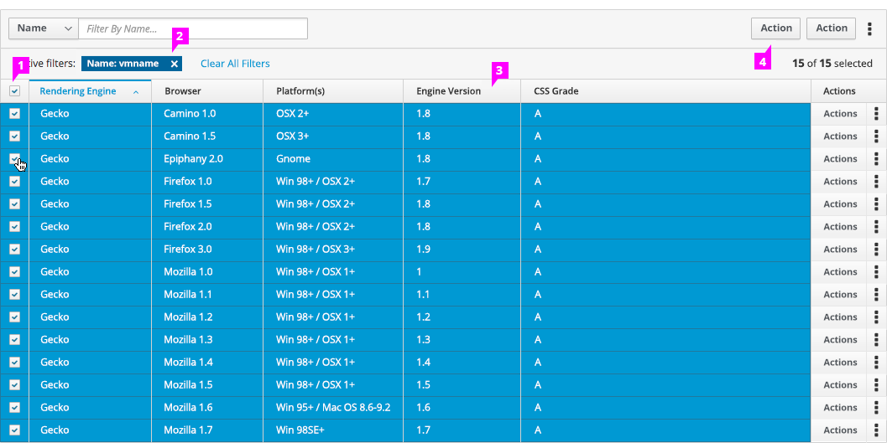

# Table View

## Table States

1. **Toolbar:** This version of the Table View is using a [Toolbar](http://www.patternfly.org/pattern-library/forms-and-controls/toolbar/) with filter and actions. Item count is also included in the toolbar on the right hand side.

2. **Column Visibility:** Control what data displays by hiding and showing columns. See [column visibility](#column-visibility) for more details about interaction with the control, and the [toolbar](http://www.patternfly.org/pattern-library/forms-and-controls/toolbar/) for more examples of icon placement in the toolbar.

3. **Sorting:** Organize data by sorting columns. All columns are sortable, simply click on the column header to sort via info found in that column.

  Active column will be highlighted with a blue line above the column and blue text. The carat indicates the direction of the sort, in this case from ascending order alphabetically.

4. **Select Row(s):** Click on the checkbox to select multiple rows in order to perform bulk actions on those rows simultaneously.

  Selecting a checkbox activates and highlights the row. This highlight is more prominent than the highlight for hovering over a row.

5. **Hover State:** When the user hovers over a row, that row will be lightly highlighted and outlined. This helps the user to isolate the row, especially when clicking on items in the row.

6. **Inline Actions:** Inline actions can be performed within a single row to manipulate the data. The most common 1-2 (max) actions are shown as a button with additional actions, if any, available via a dropdown menu. These actions should use words rather than icons for clarity. Please reference [Kebab Menu](http://www.patternfly.org/pattern-library/widgets/#kebabs) for details.

7. **Row Shading:** Use alternating row colors to help the user read the content of the table more easily.

8. **Disabled** (optional): Users can use "--" when the value of a cell should be rendered as disabled.

## Table States – continued

1. **Select All Rows:** Selecting the checkbox in the header row selects all rows on the page. The total number of rows selected is shown near the table action buttons.

2. **Filtering** (optional): User can see results of simple filters here. Results include the item and results count, list of active filters (with ability to remove individual filters), and button to clear all filters.

3. **Column Reordering:** User can change the order of columns listed in the table. Click on a column header and drag it along the row of headers into the desired position. Note that only one column can be moved at a time.

4. **Bulk Item Actions:** Bulk item action buttons are activated when multiple rows are selected. Some actions are available as both a table action and a bulk item action. The number of rows selected is shown near the table action buttons.

## Empty State

1. **Empty State:** If no items exist in the table, display the empty state pattern. Simple filter feature will be disabled within the data toolbar in this state. However, table actions will remain enabled.

## Column Visibility

1. **Column Visibility Icon:** Displays in the [toolbar](http://www.patternfly.org/pattern-library/forms-and-controls/toolbar/) in the Sort control group after the Filter control group. Sort controls may or may not be include in the toolbar. If sort controls are included, then column visibility is the last item in the Sort control group.

2. **Column Visibility Dropdown:** Lists all columns that can be displayed in the table.

  - Each list item is a checkbox with the column header as the label.

  - The list is sorted by the same order that the columns appear in the table.

  - When a checkbox selection is cleared, the column is removed from the table, and the other columns expand to fill the width of the table. Alternatively, when a checkbox is selected, the column is added to the table.

## What’s not covered in the current design but will be covered in future sprints:

- Simple Sort

- Ability to expand and collapse rows to give user the option to view more details on each item

- Multi Column Sort

- Stick Column Headers

- Mobile Design

## Additional Notes about Behavior

- **Pagination:** Table view supports pagination. See [Pagination](https://github.com/patternfly/patternfly-design/tree/master/pattern-library/navigation/pagination/design) for more details.
